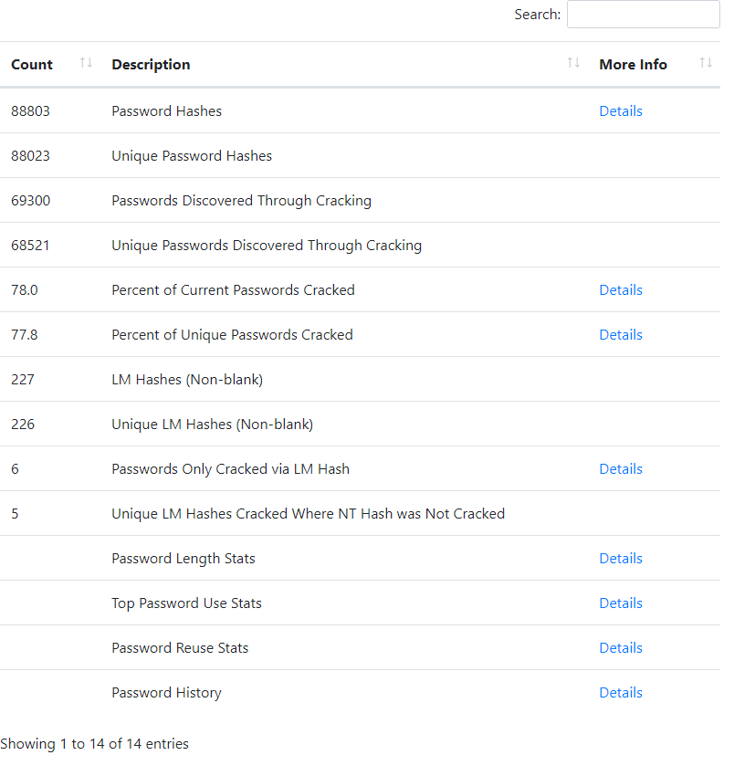

# Domain Password Audit Tool (DPAT)

### Fork includes updates for password wordlist output, cosmetics, and table search / sorting.

##### Based entirely on the awesome work of clr2of8

This is a python script that will generate password use statistics from password hashes dumped from a domain controller and a password crack file such as hashcat.potfile generated from the Hashcat tool during password cracking. The report is an HTML report with clickable links.




A full video tutorial and demo can be viewed here: [http://www.blackhillsinfosec.com/?p=5527](http://www.blackhillsinfosec.com/?p=5527).

You can run the python script as follows.

```sh
dpat.py -n customer.ntds -c hashcat.potfile -g "Domain Admins.txt" "Enterprise Admins.txt"
```
The two required parameters are the hashes extracted from the domain controller `-n` and the list of cracked passwords `-c` generated by tools like Hashcat or JohnTheRipper.

Note that the group lists at the end (-g "Domain Admins.txt" "Enterprise Admins.txt") are optional. Try this out on the example files provided in the sample_data folder of this project. The sample data was built from census data for common first and last names and passwords from the well known rockyou list.

Your customer.ntds file should be in this format:
> domain\username:RID:lmhash:nthash:::

You can get this file by first dumping the password hashes from your domain controller by executing the following command in an administrative command prompt on a domain controller. Just make sure you have enough disk space to store the output in c:\temp. The amount of space needed will be slightly larger than the size of the ntds.dit file that is currently on the disk, as this performs a backup of that file and some registry settings.

```sh
ntdsutil "ac in ntds" "ifm" "cr fu c:\temp" q q
```

The ntdsutil command will create the two files, `Active Directory\ntds.dit` and `registry\SYSTEM`, that are needed. You can then turn this output into the format expected by DPAT using [secretsdump.py](https://github.com/CoreSecurity/impacket/blob/master/examples/secretsdump.py). Secretsdump comes pre-installed on Kali Linux or can be easily installed on Windows using [these instructions](https://medium.com/@airman604/installing-impacket-on-windows-ded7ba8bec9a).


```sh
secretsdump.py -system registry/SYSTEM -ntds "Active Directory/ntds.dit" LOCAL -outputfile customer
```

If you would like to report on password history, include the `-history` flag as shown below. Note: Jan/2020 Josh Wright reported that the history hashes are not exported correctly on ntds.dit files from Win2K16 TP4 and later. See this [issue](https://github.com/SecureAuthCorp/impacket/issues/656).


```sh
secretsdump.py -system registry/SYSTEM -ntds "Active Directory/ntds.dit" LOCAL -outputfile customer -history
```

Note: Try using `impacket-secretsdump` instead of `secretsdump.py` on Kali Linux if secrectsdump.py can't be found.

The command above will create a file called "customer.ntds" which you will use with this tool (DPAT) as well as for password cracking. You can now proceed with your password cracking efforts to create a crack file in this format (which is the default output of the Hashcat tool):

>nthash:password

Or for LM Hashes:
>lmhashLeftOrRight:leftOrRightHalfPasswordUpcased

The DPAT tool also supports output from John the Ripper (same format as hashcat.potfile but prepended with $NT$ or $LM$)

The optional "-g" option is followed by a list of any number of files containing lists of users who are in the given group such as "Enterprise Admins" or "Domain Admins". The file can be in the format output by the [PowerView PowerShell script](https://github.com/PowerShellMafia/PowerSploit/tree/master/Recon) as shown in the example below:

```sh
Get-NetGroupMember -Recurse -GroupName "Domain Admins" > "Domain Admins.txt"
```

or to read a group from another domain use something like the following (note that name of the other domain and the domain controller can be obtained with Get-NetForestDomain)

```sh
Get-NetGroupMember -Recurse -GroupName "Enterprise Admins" -Domain "some.domain.com" -DomainController "DC01.some.domain.com" > "Enterprise Admins.txt"
```
Alternatively, the group files can simply be a list of users, one per line, in the following format:

>domain\username

[Here](https://gist.githubusercontent.com/joswr1ght/c557f8627832d54458c810e43be9c055/raw/b46e5e976196a20e7ecfe88da7d7a22c747d64e0/groupenumeration.ps1) is a PowerShell one-liner to create group files for all groups.

The Domain Password Audit Tool also has the handy feature to finish cracking the LM hashes for any hashes where the NT hash was not cracked. This asssumes that you have used Hashcat to brute force all 7 character passwords with the following command:

```sh
./hashcat.bin -m 3000 -a 3 customer.ntds -1 ?a ?1?1?1?1?1?1?1 --increment
```

Or to crack LM hashes with John the Ripper instead:

```sh
john --format=LM customer.ntds
```

To see all available DPAT options use the '-h' or '--help' option

```sh
usage: dpat.py [-h] -n NTDSFILE -c CRACKFILE [-o OUTPUTFILE]
               [-d REPORTDIRECTORY] [-w] [-s]
               [-g [GROUPLISTS [GROUPLISTS ...]]]

This script will perfrom a domain password audit based on an extracted NTDS
file and password cracking output such as Hashcat.

optional arguments:
  -h, --help            Show this help message and exit
  -n NTDSFILE, --ntdsfile NTDSFILE
                        NTDS file name (output from SecretsDump.py)
  -c CRACKFILE, --crackfile CRACKFILE
                        Password Cracking output in the default form output by
                        Hashcat, such as hashcat.potfile
  -o OUTPUTFILE, --outputfile OUTPUTFILE
                        The name of the HTML report output file, defaults to
                        _DomainPasswordAuditReport.html
  -d REPORTDIRECTORY, --reportdirectory REPORTDIRECTORY
                        Folder containing the output HTML files, defaults to
                        DPAT Report
  -w, --writedb         Write the SQLite database info to disk for offline
                        inspection instead of just in memory. Filename will be
                        "pass_audit.db"
  -s, --sanitize        Sanitize the report by partially redacting passwords
                        and hashes. Appends the report directory with
                        " - Sanitized"
  -g [GROUPLISTS [GROUPLISTS ...]], --grouplists [GROUPLISTS [GROUPLISTS ...]]
                        The name of one or multiple files that contain lists
                        of usernames in particular groups. The group names
                        will be taken from the file name itself. The username
                        list must be in the same format as found in the NTDS
                        file such as some.ad.domain.com\username. Example: -g
                        "Domain Admins.txt" "Enterprise Admins.txt"
```

## Originally Sponsored by:

[](http://www.blackhillsinfosec.com)
